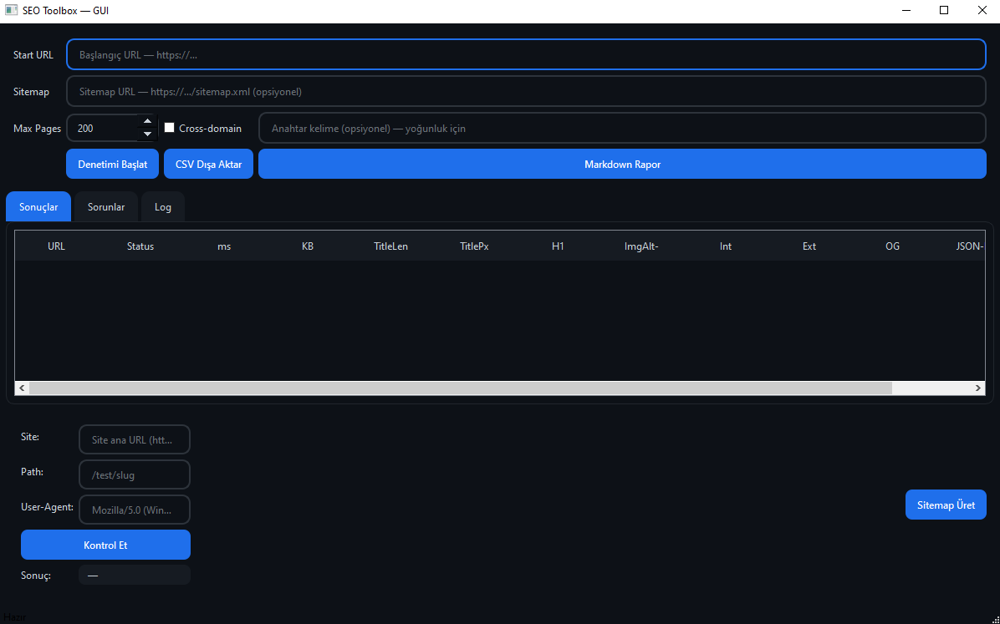

# ebs-seo-toolbox
SEO Toolbox GUI — Modern Metro Tasarım ile On-Page SEO Denetimi

## 👤 Yazar
Ebubekir Bastama

## 📌 Özellikler
- Modern PyQt6 arayüz (Metro style)
- URL veya sitemap ile site tarama
- Robots.txt uyumlu crawl
- SEO metrikleri:
  - Title / Meta description / H1 kontrolü
  - Görsellerde alt metin eksikleri
  - Broken link checker
  - Open Graph, Twitter Card, JSON-LD, hreflang
- Keyword density analizi (anahtar kelime yoğunluğu)
- CSV ve Markdown raporu dışa aktarma
- Taranan URL’lerden otomatik sitemap üretme

## 🚀 Kurulum
```bash
git clone https://github.com/kullaniciadi/ebs-seo-toolbox.git
cd ebs-seo-toolbox
pip install -r requirements.txt
```

## 🖥️ Kullanım
GUI başlatmak için:
```bash
python seo_toolbox_gui.py
```

### CLI (opsiyonel)
```bash
python seo_toolbox_gui.py --start https://www.ornek.com --max-pages 50
```

## 📊 Neden Kullanılmalı?
- Hızlıca **teknik SEO sorunlarını** görmek için
- Başlık, açıklama, görseller gibi **temel on-page faktörleri** kolayca analiz etmek için
- **Broken linkleri** ve eksik alt metinleri tespit etmek için
- **Anahtar kelime yoğunluğunu** ölçüp içerik optimizasyonu yapmak için
- Raporları CSV/Markdown olarak alıp ekip ile paylaşmak için

## 📷 Ekran Görüntüsü


## 📄 Lisans
MIT
